The first step you need create an account cloudflare and Freenom.

https://dash.cloudflare.com/login<br/>
https://my.freenom.com/clientarea.php

Freenom: Register your domain Which is free. <br/>
cloudflare: It will add https to your domain.

Let go!!!

## Freenom
If you was logged on freenom go `Services` -> `Register a New Domain` on header menu.<br/>
Search your domain and check available of it.
Wait for done (It take 15s).<br/>
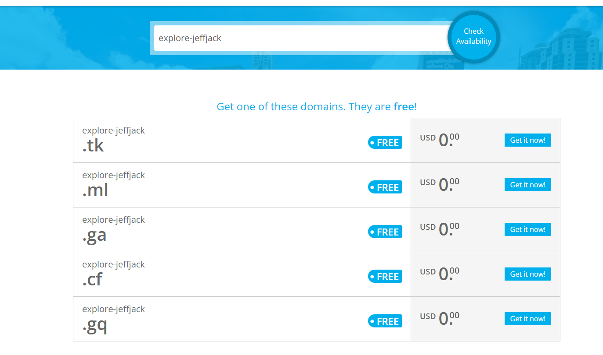

Click to `get it now` button to get domain.<br/>
Checkout it in the your cart. complete order domain<br/>
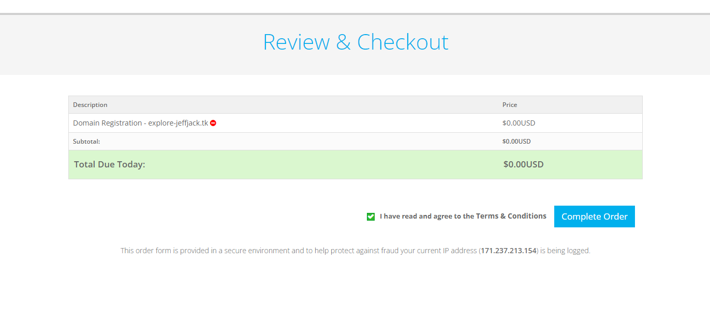

When done. Now you can go `Services` -> `My Domain` for check it.<br/>
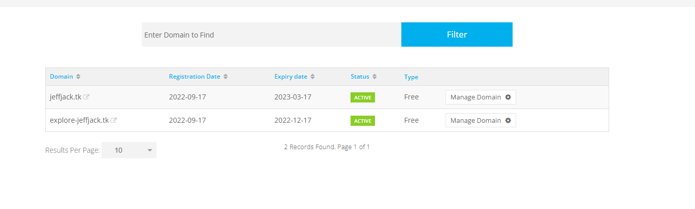

OK hold it on the browser tab.

## Cloudflare
If you was logged on Cloudflare go `Website` tab on left sidebar.<br/>
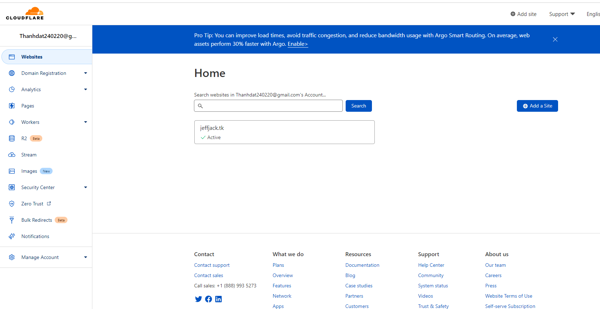

Click to `Add a site` button. Input your domain.<br/>
Then you can see dashboard for charge. Select your plan and click continues. <br/>
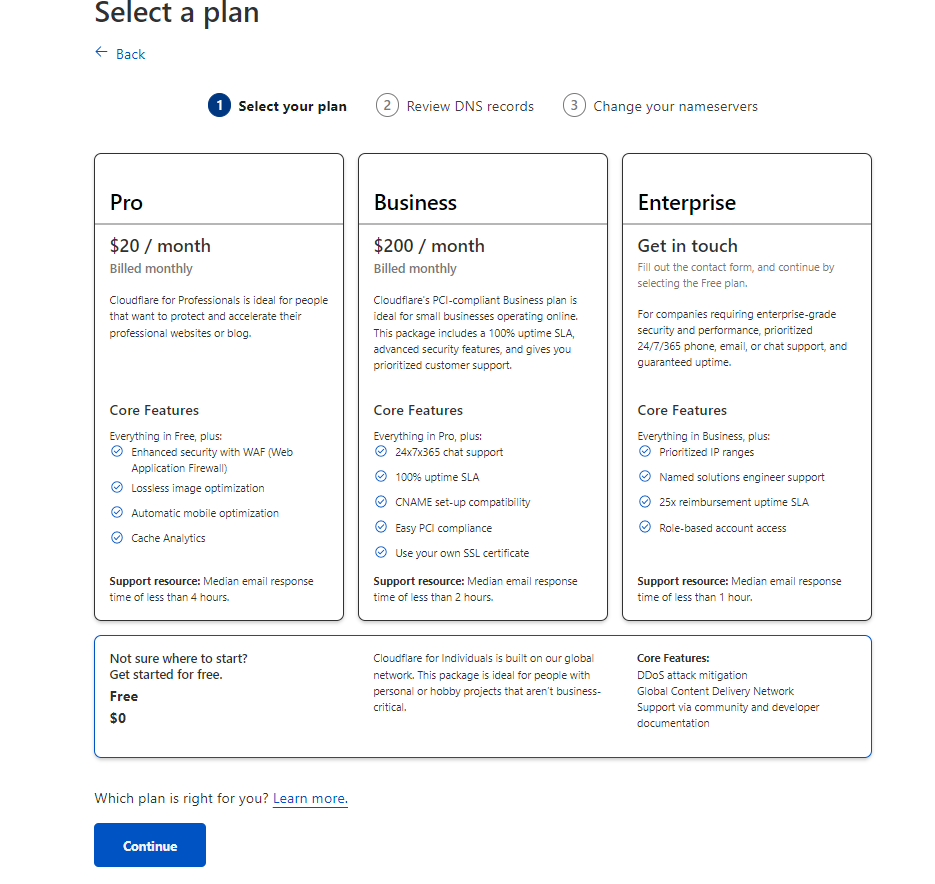

Cloudflare will Review DNS. Click to `Add record` then you can see same the image.
- input `name`: @
- input `IPv4`: your IP (the same image) <br/>
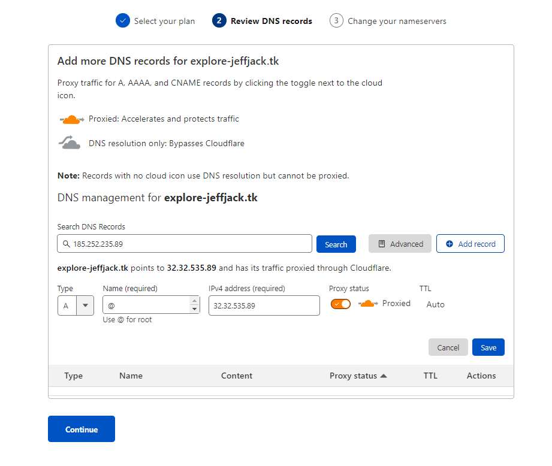
Click to save. Click to continues<br/>
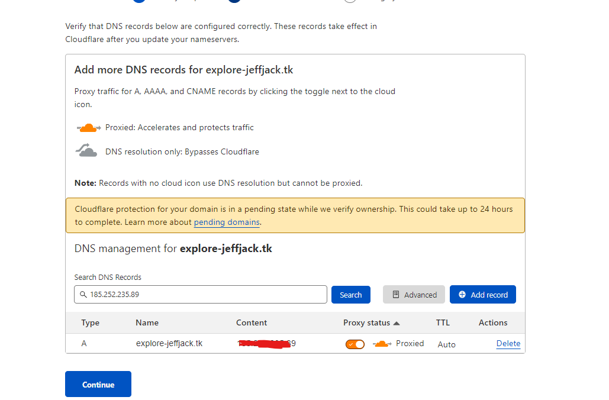

- Last step is change server name
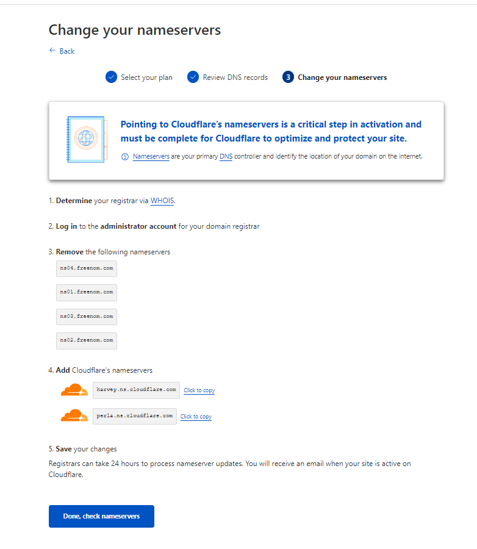
<br/>
You can see : `Add Cloudflare's nameservers` in image. It's nameservers we need add.

Go back to freenom tab.
click to `Manage domain` -> `Manage Tools` -> `Nameservers`<br/>
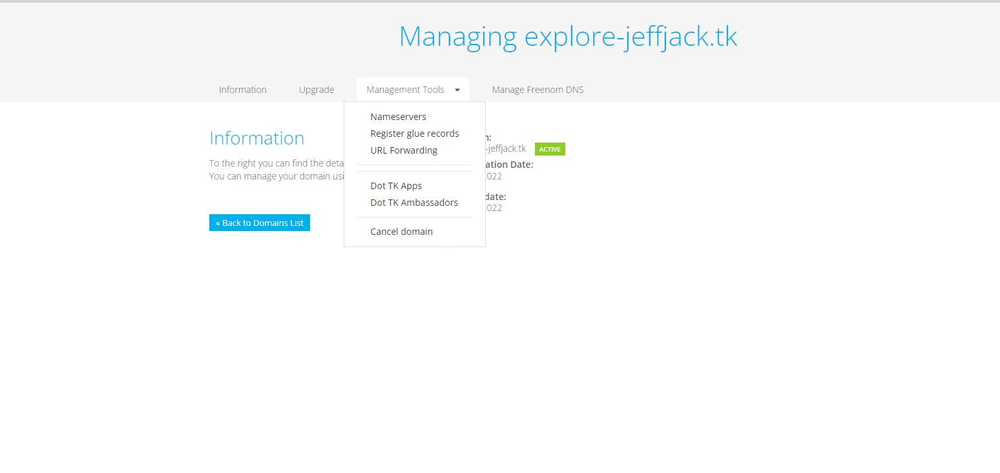

And add your nameservers
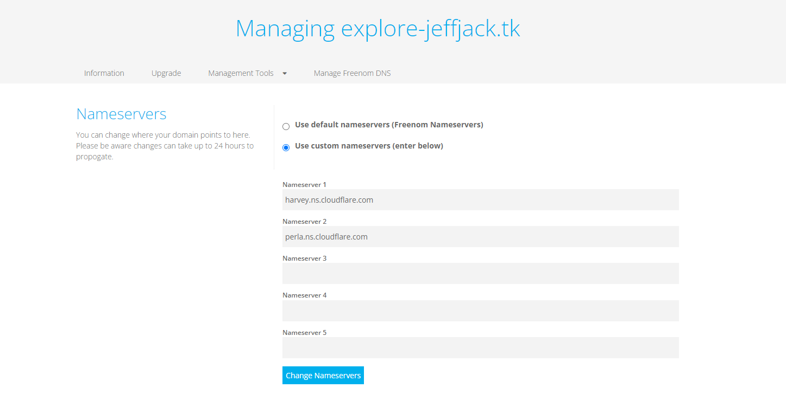

click `Change nameservers` to save. <br/>


Then it done. Go back to cloudflare tab. Click to `Check nameservers`.<br/> 


You Choose config for Website<br/>
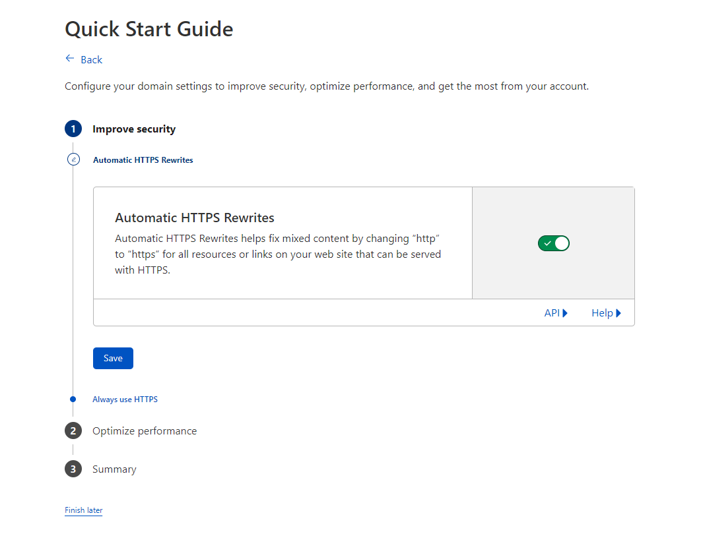
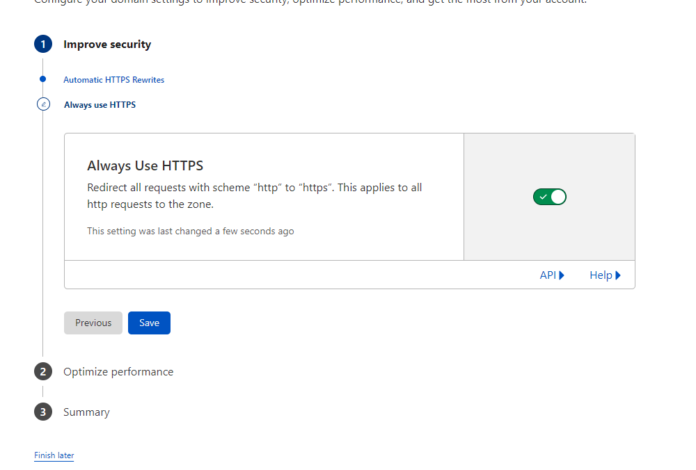


When you done config successfully. We need wait cloudflare checking.<br/>
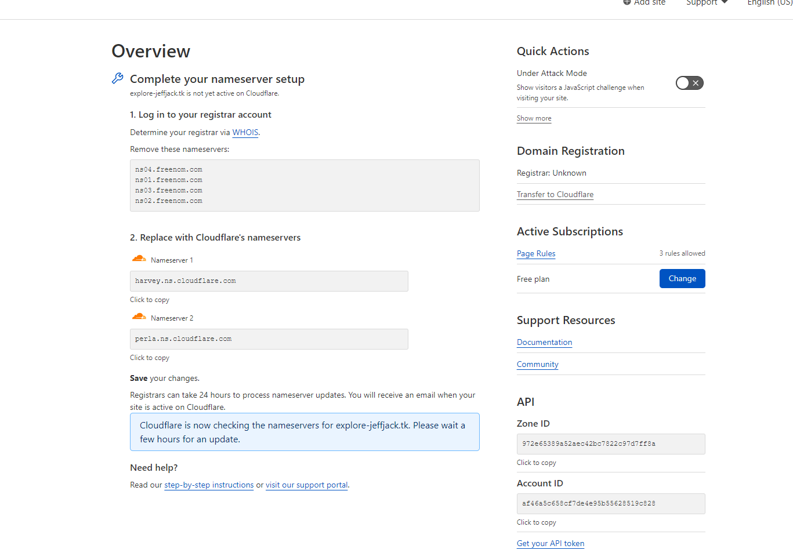

Take 5p you can that. All the done.<br/>
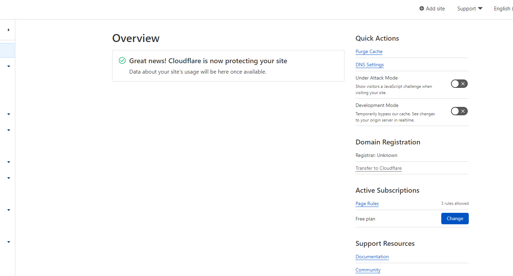

## Nginx
The last we need control your VPS:
install nginx
```
sudo apt update && sudo apt -y upgrade
sudo apt -y install sudo vim zip unzip git
sudo apt -y install nginx-full
```

Edit your nginx proxy to `haqq` api
edit file `/etc/nginx/sites-enable/default` is
```
server {
    listen 80 default_server;
    server_name <your-domain>;

    location / {
        add_header Access-Control-Allow-Origin *;
        proxy_pass http://<your-ip>:1317;
        #proxy_redirect http://<your-ip>:1317;
    }

    location /rpc {
        proxy_set_header Host $host;
        proxy_set_header X-NginX-Proxy true;
        proxy_pass http://<your-ip>:26657/;
    }
}
```

Restart nginx
```
sudo systemctl restart nginx.service
```

ok.
Now you can go https://you-domain to check api. You can see that<br/>
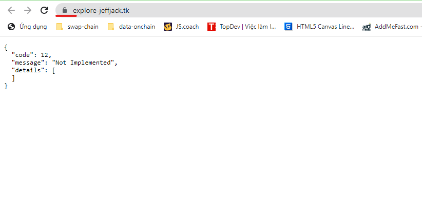

You can use `https://you-domain` to update `api` field in `explore/src/chains/testnet/haqq.json`.

Now you can go to website deploy on firebase to check it. Good luck