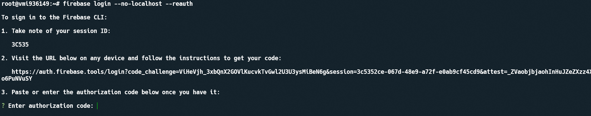

## Login to firebase
go to https://console.firebase.google.com/ 
If you were logged then click to `add project` button.


Input your project name and continues


Wait for all done then you can see your project

### Install firebase on your device
In `haqq` node VPS run command 
```
npm install -g firebase-tools
```

Then firebase-tools was installed. Run command
```
firebase login --no-localhost
```
Open link on CLI and get your code.<br/>


After input code to CLI to auth<br/>


Finally go to `/explore` folder and init config with command
```
firebase init hosting
```
Then you can see dashboard console Then Follow steps:
- Choose ->  Use an existing project
- Select project you created.<br/>


- Choose options:<br/>


### Deploy
On `/explore` folder
```
yarn build
```

After building is successfully. Run command deploy
```
firebase deploy --only hosting
```

When you see that. Your deploy complete.<br/>
